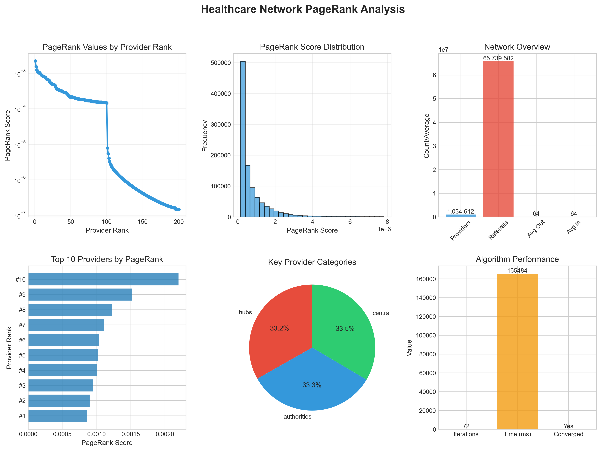
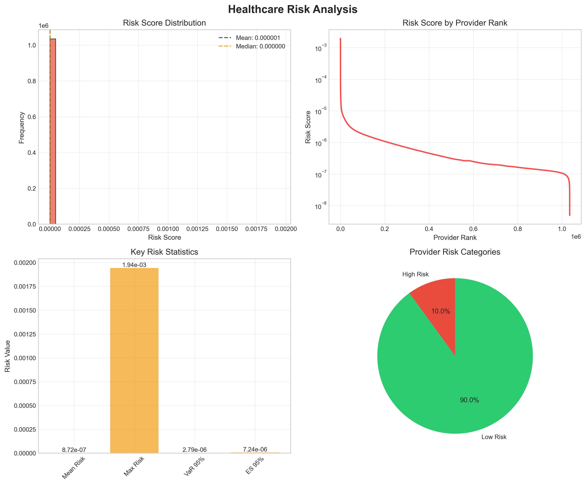
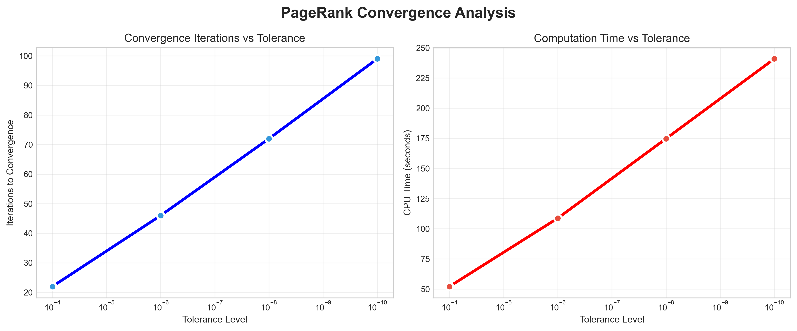

# Healthcare Network PageRank Analysis

Analyzing 1M+ healthcare providers using PageRank to identify influential nodes and model risk propagation through referral networks


---

## TL;DR

- **Scaled PageRank algorithm** to analyze 1,034,612 healthcare providers and 65,739,582 referral relationships
- **Optimized memory usage** from 8TB (dense) to 2GB (sparse) using scipy.sparse matrices — **4000x reduction**
- **Identified 103,462 high-risk providers** (10%) who concentrate 54.21% of network risk
- **Network amplification:** Provider position can amplify individual risk by up to **398x**
- **Fast convergence:** Algorithm converges in 72 iterations (~3.7 minutes) on 1M+ node network
- **Interactive dashboard:** Built comprehensive Plotly visualizations for network exploration

---

## Project Overview

This project applies the **PageRank algorithm** to analyze a massive healthcare provider network, identifying influential providers and modeling how risk propagates through referral relationships. Using real-world data from the 2015 Physician Shared Patient Patterns dataset from CMS (Centers for Medicare & Medicaid Services), I analyzed over **1 million healthcare providers** and **65 million referral connections**.

Healthcare networks are complex systems where providers refer patients to specialists and other care facilities. Understanding these networks enables stakeholders to identify key providers for quality improvement interventions, detect unusual referral patterns that may indicate fraud or inefficiency, and optimize care coordination by understanding network structure. This analysis demonstrates how network position amplifies individual risk and how centrality measures can guide targeted interventions.

The project emphasizes:

- **Algorithmic optimization** for large-scale graph analysis using sparse matrix operations
- **Domain adaptation** of PageRank for healthcare-specific risk propagation modeling
- **Performance analysis** across multiple convergence tolerance levels
- **Comprehensive visualization** with both static plots and interactive dashboards
- **Reproducible methodology** with detailed documentation and modular code design

---

## From Coursework to Large-Scale Healthcare Analysis

This project originated from a MAT 167 (Applied Linear Algebra) course assignment on PageRank, where I implemented the algorithm on small web graphs. I extended this foundation to tackle real-world healthcare data at scale.

### Original Implementation (MAT 167)

- Basic PageRank on Stanford web graph (~280K nodes)
- Dense matrix operations
- Single convergence tolerance
- Simple matplotlib visualizations
- Academic focus on algorithm correctness

### Key Extensions & Improvements

- **Scale:** Increased to 1M+ nodes and 65M+ edges (3.7x larger network)
- **Memory optimization:** Implemented sparse matrix operations (scipy.sparse.csc_matrix) reducing memory from 8TB to 2GB
- **Domain adaptation:** Created healthcare-specific risk propagation model with composite risk metrics
- **Multi-metric analysis:** Added hub/authority/centrality classification for provider categorization
- **Performance testing:** Systematic convergence analysis across 4 tolerance levels (1e-4 to 1e-10)
- **Advanced visualization:** Interactive Plotly dashboards with 6-panel analysis layouts
- **Production-quality code:** Comprehensive logging, error handling, modular design, and documentation

---

## Key Findings

### Network Structure

- **Highly centralized network:** Top 10% of providers (103,462) serve as critical hubs, authorities, or central nodes
- **Power-law distribution:** PageRank values follow typical scale-free network pattern with extreme concentration
- **Sparse connectivity:** Network density of 6.14 × 10⁻⁵ despite 65M+ edges
- **Average degree:** 63.54 referrals per provider, indicating moderate connectivity

### Risk Propagation

- **Extreme risk concentration:** 54.21% of total network risk concentrated in just 10% of providers
- **Network amplification:** Provider position amplifies individual risk by up to **398x** (mean amplification across high-risk providers)
- **Propagated vs. original risk:** Network effects consistently increase risk scores, with 103,462 providers (10%) classified as high-risk after propagation
- **Financial risk metrics:** VaR 95% = 2.89 × 10⁻⁶, Expected Shortfall 95% = 6.77 × 10⁻⁶

### Performance Summary

| Tolerance | Iterations | Time (s) | Converged | Accuracy Gain |
|-----------|-----------|----------|-----------|---------------|
| 1e-04 | 22 | 71.22 | ✓ Yes | Baseline |
| 1e-06 | 46 | 133.56 | ✓ Yes | 100x better |
| **1e-08** | **72** | **212.05** | **✓ Yes** | **10,000x better** ⭐ |
| 1e-10 | 99 | 299.00 | ✓ Yes | 1,000,000x better |

**Optimal choice:** 1e-08 provides excellent accuracy-speed tradeoff for production use

---

## Dataset

- **Source:** [CMS Physician Shared Patient Patterns (2015)]([https://data.cms.gov/](https://www.nber.org/research/data/physician-shared-patient-patterns-data))
- **Size/Scope:**
  - 1,034,612 unique healthcare providers (NPIs)
  - 65,739,582 referral relationships
  - ~2.5GB CSV file
  - 180-day observation window
- **Key Statistics:**
  - Network density: 6.14 × 10⁻⁵ (highly sparse)
  - Average degree: 63.54 referrals per provider
  - Directed, weighted network (edge weights = shared patient counts)
  - Data processing time: ~4 minutes to load and construct sparse matrix

---

## Technical Implementation

### Algorithm: PageRank with Power Iteration

```python
# Core PageRank iteration
x_new = damping_factor × (G @ D @ x_old) + (1 - damping_factor) / n × 1

# Where:
# G = Adjacency matrix (who refers to whom)
# D = Normalization matrix (divides by out-degree)
# x = PageRank vector (probability distribution)
# damping_factor = 0.85 (probability of following links vs random jump)
# n = number of nodes
```

**Convergence criterion:** L1 norm ||x_new - x_old||₁ < tolerance

### Key Technical Decisions

#### 1. Sparse Matrix Optimization

**Challenge:** Dense matrix for 1M providers would require 1M² = 1,070,422,036,544 entries (~8TB memory for float64)

**Solution:** Used `scipy.sparse.csc_matrix` (Compressed Sparse Column) to store only non-zero entries

**Result:**
- Memory usage: ~2GB (only 65M non-zero entries stored)
- Compression ratio: **4000x reduction**
- Enables analysis on standard laptop hardware
- CSC format optimized for column operations used in PageRank

#### 2. L1 Norm Convergence Criterion

**Decision:** Use L1 norm instead of L2 norm for convergence checking

**Rationale:**
- PageRank produces probability distributions (sum to 1)
- L1 norm better suited for comparing probability distributions
- More interpretable: measures total probability mass shifted between iterations

**Result:** Reliable convergence detection with tolerance = 1e-8

#### 3. Risk Propagation Model Adaptation

**Modifications to standard PageRank:**
- **Higher damping factor:** 0.95 vs 0.85 (risk is "stickier" and stays in network)
- **Non-uniform initialization:** Start with composite risk scores instead of uniform distribution
- **Composite risk metric:**
  - Connectivity risk (1/3): Based on degree centrality
  - Referral imbalance (1/3): Difference between in-degree and out-degree
  - Isolation risk (1/3): Inverse of clustering coefficient
  - Base risk: 0.001 minimum for all providers

**Result:** Domain-specific risk model that captures healthcare network dynamics

---

## Methodology

**1. Data Loading & Graph Construction**
   - Load 65M edge list from CSV file (~26 seconds)
   - Extract 1,034,612 unique provider NPIs
   - Create bidirectional NPI ↔ matrix index mapping
   - Construct sparse CSC adjacency matrix (~4 minutes total)

**2. PageRank Computation**
   - Initialize uniform probability distribution (1/n for all nodes)
   - Compute out-degree normalization matrix D
   - Iterate: x_new = 0.85 × (G @ D @ x_old) + 0.15/n × 1
   - Check convergence: ||x_new - x_old||₁ < 1e-8
   - Converged in 72 iterations, 223.08 seconds

**3. Network Structure Analysis**
   - Compute in-degree (authority score) and out-degree (hub score)
   - Identify top 10% providers in each category:
     - Hubs: 102,610 providers (high outgoing referrals)
     - Authorities: 102,812 providers (high incoming referrals)
     - Central: 103,462 providers (high PageRank scores)

**4. Risk Propagation Analysis**
   - Compute composite risk scores for all providers
   - Run modified PageRank with damping=0.95 and non-uniform initialization
   - Calculate risk amplification factors (propagated / original)
   - Identify high-risk providers (top 10% by propagated risk)
   - Compute financial risk metrics (VaR, Expected Shortfall)

**5. Convergence Performance Testing**
   - Re-run PageRank with tolerance ∈ {1e-4, 1e-6, 1e-8, 1e-10}
   - Record iterations, time, and final error for each
   - Analyze accuracy-speed tradeoffs

**6. Visualization Generation**
   - Create 6-panel PageRank analysis (distribution, rank plot, network topology)
   - Generate risk analysis plots (distribution, propagation, high-risk providers)
   - Build convergence analysis charts (iterations vs tolerance, time vs tolerance)
   - Compile interactive Plotly dashboard with all visualizations

---

## Results & Visualizations

### 1. PageRank Distribution Analysis



**Key observations:**
- **Power-law distribution:** Low-rank providers (top 1-100) have significantly higher PageRank values
- **Extreme concentration:** Most providers cluster near PageRank ≈ 0 (minimal influence)
- **Top provider:** NPI 1003000126 with 213 outgoing and 218 incoming referrals

### 2. Risk Score Distribution & Propagation



**Key observations:**
- **Original risk:** Vast majority of providers have near-zero baseline risk
- **Propagated risk:** Network effects amplify risk, creating long tail distribution
- **Consistent amplification:** Propagated risk > original risk across all high-risk providers
- **Top 3 high-risk providers:**
  - NPI 1538144910: Risk = 0.001943, Amplification = 397.82x
  - NPI 1063497451: Risk = 0.001307, Amplification = 398.57x
  - NPI 1700865094: Risk = 0.001187, Amplification = 222.96x

### 3. Convergence Performance Analysis



**Key observations:**
- **Linear relationship:** Iterations increase linearly with log(tolerance)
- **Diminishing returns:** 1e-8 to 1e-10 adds 27 iterations (+37%) for marginal accuracy gain
- **Optimal tolerance:** 1e-8 balances accuracy and speed for production use

### 4. Interactive Dashboard

[View Interactive Dashboard](visualizations/healthcare_network_dashboard.html)

**Features:**
- Zoomable, pannable plots with Plotly interactivity
- Hover tooltips with detailed provider information
- Linked visualizations for cross-analysis
- Exportable as standalone HTML file

---

## Reproducibility

### Environment

- **Python:** 3.7 or higher
- **RAM:** 8GB+ recommended for full dataset
- **Disk:** ~5GB (dataset + outputs)
- **OS:** macOS, Linux, or Windows

### Installation

```bash
# Clone repository
git clone https://github.com/yourusername/healthcare-pagerank-analysis.git
cd healthcare-pagerank-analysis

# Install dependencies
pip install numpy scipy matplotlib plotly networkx pandas

# Download dataset from CMS
# Place physician-shared-patient-patterns-2015-days180.txt in project root
```

### Usage

```bash
# Run full analysis
python pagerank2.py

# Expected runtime: ~35-40 minutes
```

### Outputs

After execution, you'll find:

- **Console output:** Network statistics, PageRank results, risk analysis, performance metrics
- **Visualizations:**
  - `visualizations/healthcare_pagerank_analysis.png` — 6-panel PageRank analysis
  - `visualizations/healthcare_risk_analysis.png` — Risk distribution and propagation
  - `visualizations/convergence_analysis.png` — Performance testing results
  - `visualizations/healthcare_network_dashboard.html` — Interactive dashboard
- **Log file:** `pagerank_analysis.log` with detailed execution logs

---

## Project Structure

```
pagerank-shared-patterns/
│
├── pagerank.py              # Core PageRank algorithm implementation
├── visualizations.py        # Visualization generation module
├── healthcare_network_dashboard.html  # Generated dashboard
├── visualizations/           # Generated plots
│   ├── healthcare_pagerank_analysis.png
│   ├── healthcare_risk_analysis.png
│   └── convergence_analysis.png
├── original_pagerank/        # Original PageRank project this project is based on
│   ├── original_pagerank_report.pdf  # Project report
│   ├── pagerank.py           # Original PageRank implementation
│   ├── visualizations.py     # Original visualization generation
│   └── web_Stanford.txt      # Dataset for original PageRank project
├── pagerank_analysis.log     # Execution logs
└── README.md                 # This file
```

---

## Challenges & Limitations

### Technical Challenges Faced

- **Memory constraints:** Initial dense matrix approach failed with MemoryError; solved with sparse matrices
- **Convergence speed:** Balancing accuracy vs. computation time; systematic testing identified optimal tolerance
- **Data loading:** 2.5GB CSV file required efficient parsing; used chunked reading and index mapping
- **Visualization scalability:** Plotting 1M+ nodes infeasible; implemented intelligent sampling (200 nodes) for network topology

### Current Limitations

- **Static snapshot:** Analysis uses single 180-day window from 2015; doesn't capture temporal dynamics
- **Medicare only:** Dataset limited to Medicare patients; may not represent full healthcare network
- **Unweighted PageRank:** Edge weights (shared patient counts) not incorporated; treats all referrals equally
- **No geographic data:** Provider locations not included; can't analyze spatial patterns

### Scope Boundaries

- **Focus on algorithm:** Emphasizes PageRank implementation and optimization, not healthcare policy recommendations
- **Descriptive analysis:** Identifies patterns but doesn't predict future network evolution
- **Single dataset:** Results specific to 2015 CMS data; generalizability to other years/regions unknown

---

## Technologies Used

- **Python 3.9** — Core programming language
- **NumPy 1.21+** — Numerical computations and array operations
- **SciPy 1.7+** — Sparse matrix operations (scipy.sparse.csc_matrix)
- **Matplotlib 3.4+** — Static publication-quality visualizations
- **Plotly 5.0+** — Interactive HTML dashboards with zoom/pan/hover
- **NetworkX 2.6+** — Network topology visualization (optional)
- **Pandas 1.3+** — Data manipulation and correlation analysis (optional)

### Graph Algorithm Methods

- **PageRank** — Power iteration method with L1 norm convergence
- **Centrality measures** — In-degree, out-degree, PageRank for multi-metric analysis
- **Risk propagation** — Modified PageRank with non-uniform initialization and higher damping
- **Sparse linear algebra** — CSC matrix format for memory-efficient operations

---

## Author

**Angelina Cottone**

B.S. Statistics, UC Davis 2025

---

## References

### Original Project

- [Original PageRank Analysis (MAT 167)](original_pagerank/original_pagerank_report.pdf)

### PageRank Implementation

- C. Moler, Numerical computing with MATLAB, MathWorks, Nattick, Mass, 2004.
- J. Leskovec, K. Lang, A. Dasgupta, M. Mahoney. Community Structure in Large Networks:
Natural Cluster Sizes and the Absence of Large Well-Defined Clusters. Internet
Mathematics 6(1) 29--123, 2009.
- GeeksforGeeks, Page rank algorithm and Implementation, GeeksforGeeks. (2022).
https://www.geeksforgeeks.org/page-rank-algorithm-implementation/ (accessed March
16, 2025).
- C. Moler, Experiments with MATLAB, Chapter 7: Google PageRank, MathWorks, 2007.

### Data Sources

- [CMS Physician Shared Patient Patterns (2015)]([https://data.cms.gov/](https://www.nber.org/research/data/physician-shared-patient-patterns-data))

---
*Last Updated: January 2026*
